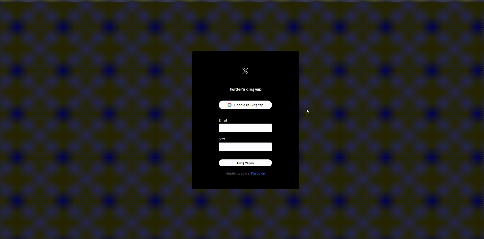

## Twitter Clone

- Twitter'ın bir kopyası olan bu proje,React, Firebase ve Tailwind kullanılarak oluşturuldu. Öncelikle e-posta ve şifre veya Google e-postanızı kullanarak projeye giriş yapabilirsiniz.Anasayfaya girdiğinizde hem metin hemde resim gönderebilirsiniz.Ayrıca gönderilerinizi düzenleyebilir veya silebilirsiniz.Ve like butonu ile gönderileri beğenebilirsiniz.Son olarak sol alt köşedeki butona tıklayarak çıkış yapabilirsiniz.

Projeyi test edebilirsiniz => https://firebase-twitter-clone-git-main-umhn-shns-projects.vercel.app/

## Kütüphaneler

- react-router-dom
- react-toastify
- react-icons
- moment
- uuid
- firebase
- tailwind

## Authentication (Kimlik Doğrulama)

- Authentication, bir kullanıcnın kimliğini doğrulama sürecidir.

- Kullanıcı adı ve şifre, parmak izi, yüz tanıma , google hesabı kullanılarak kullanıcının kimliği doğrulanabilir.

## Authorization (Yetkilendirme)

- Authorization, bir kullanıcının sistemin kaynaklarına / işlevlerine / sayflarına erişme izni verme veya reddetme sürecidir

- Yani Kimlik Doğrulama başarılı olduktan soınra kullanıcının ne kadar erişime sahip olduğunu belirleme sürecidir.

## Gif

